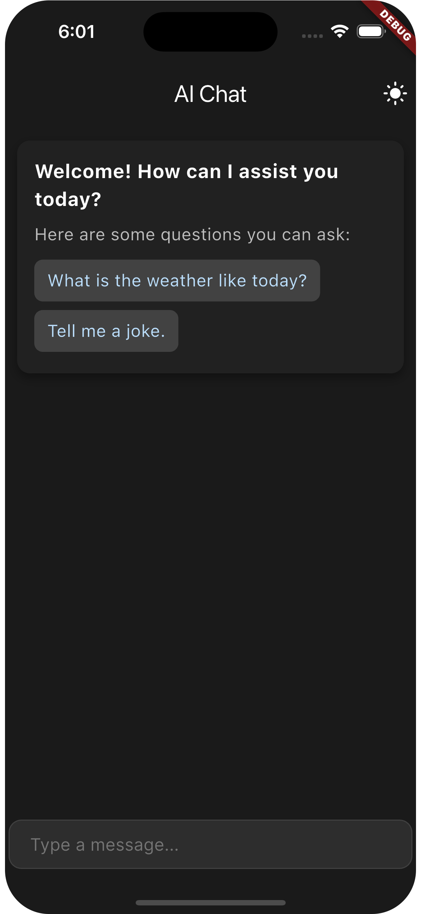
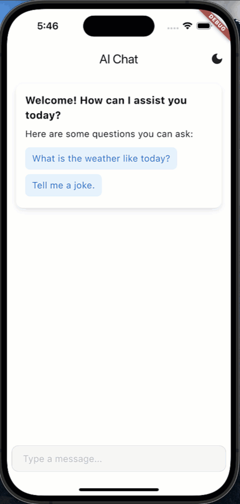

# Flutter Gen AI Chat UI

[](https://pub.dev/packages/flutter_gen_ai_chat_ui)
[](https://opensource.org/licenses/MIT)

A modern, customizable chat UI package for Flutter applications, optimized for AI interactions.

<!-- Images placed in a table for even spacing -->
<table>
  <tr>
    <td align="center">
      
    </td>
    <td align="center">
      
    </td>
  </tr>
</table>

## Table of Contents

- [Features](#features)
- [Installation](#installation)
- [Dependencies](#dependencies)
- [Quick Start](#quick-start)
- [Advanced Usage](#advanced-usage)
- [Customization](#customization)
- [Examples](#examples)
- [Keyboard Shortcuts](#keyboard-shortcuts)
- [Troubleshooting](#troubleshooting)
- [Platform Support](#platform-support)
- [Performance](#performance)
- [API Documentation](#api-documentation)
- [Contributing](#contributing)
- [License](#license)

## Features

- 🎨 Light/Dark mode support
- 💫 Animated message bubbles
- 📱 Responsive design (Mobile/Tablet/Desktop)
- 🔄 Built-in loading indicators
- 👋 Welcome message support
- ⭐️ Example questions functionality
- 🌐 RTL support
- ⚡️ Performance optimized
- 🎯 Keyboard shortcuts support
- 🔒 Privacy-focused design
- 🎭 Customizable avatar support
- 📊 Message status indicators
- 🔍 Search functionality
- 📱 Adaptive layouts
- 🖼️ Image message support
- 📎 File attachment support

## Installation

Add this to your package's `pubspec.yaml` file:

```yaml
dependencies:
  flutter_gen_ai_chat_ui: ^1.0.0
```

## Dependencies

This package uses the following pub.dev packages:

- [provider](https://pub.dev/packages/provider) ^6.0.0 - State management
- [dash_chat_2](https://pub.dev/packages/dash_chat_2) ^0.0.15 - Core chat UI components
- [shimmer](https://pub.dev/packages/shimmer) ^2.0.0 - Loading animations
- [google_fonts](https://pub.dev/packages/google_fonts) ^6.2.1 - Typography

## Quick Start

Here's a basic example of how to implement the chat UI:

```dart
import 'package:flutter_gen_ai_chat_ui/flutter_gen_ai_chat_ui.dart';

class SimpleChatScreen extends StatefulWidget {
  @override
  State<SimpleChatScreen> createState() => _SimpleChatScreenState();
}

class _SimpleChatScreenState extends State<SimpleChatScreen> {
  late final ChatMessagesController _controller;

  @override
  void initState() {
    super.initState();
    _controller = ChatMessagesController(
      onSendMessage: (message) async {
        // Handle message sending here
        return "Response to: $message";
      },
    );
  }

  @override
  Widget build(BuildContext context) {
    return Scaffold(
      appBar: AppBar(title: Text('AI Chat')),
      body: AiChatWidget(
        config: AiChatConfig(
          userName: 'User',
          aiName: 'AI Assistant',
          hintText: 'Type a message...',
        ),
        controller: _controller,
      ),
    );
  }
}
```

## Advanced Usage

For more advanced usage, you can customize various aspects of the chat UI:

```dart
AiChatWidget(
  config: AiChatConfig(
    userName: 'User',
    aiName: 'AI Assistant',
    hintText: 'Type a message...',
    enableAnimation: true,
    showTimestamp: true,
    maxWidth: 900, // For desktop/tablet layouts
    exampleQuestions: [
      ChatExample(
        question: 'What is the weather like today?',
        onTap: (controller) {
          controller.handleExampleQuestion(
            'What is the weather like today?',
            ChatUser(id: '1', firstName: 'User'),
            ChatUser(id: '2', firstName: 'AI Assistant'),
          );
        },
      ),
    ],
    // Customize input decoration
    inputDecoration: InputDecoration(
      // Your custom decoration
    ),
  ),
  controller: _controller,
  // Custom welcome message
  welcomeMessageBuilder: () => YourCustomWelcomeWidget(),
),
```

## Customization

### Theme Customization

The package supports custom theming through `CustomThemeExtension`:

```dart
CustomThemeExtension(
  chatBackground: Colors.white,
  messageBubbleColor: Colors.grey[200]!,
  userBubbleColor: Colors.blue[100]!,
  messageTextColor: Colors.black87,
  inputBackgroundColor: Colors.grey[100]!,
  inputBorderColor: Colors.grey[300]!,
  hintTextColor: Colors.grey[400]!,
  backToBottomButtonColor: Colors.grey[800]!,
)
```

### Controller

The `ChatMessagesController` allows you to:

- Handle message sending
- Clear chat history
- Handle example questions
- Manage welcome message visibility

## Examples

The package includes two example implementations:

### Simple Example

Basic chat implementation with minimal configuration. Perfect for quick implementation.

### Detailed Example

Advanced features demonstration including custom theming, welcome message, example questions, loading states, and responsive layout.

## ⏳ Loading Widget

The package includes a customizable loading widget that can be used independently:

```dart
// Show loading dialog
LoadingWidget.show(
  context,
  texts: ['Loading...', 'Please wait...'],
  interval: Duration(seconds: 2),
  textStyle: TextStyle(fontSize: 16),
);

// Show as bottom sheet
LoadingWidget.showAsBottomSheet(
  context,
  texts: ['Processing...', 'Almost done...'],
);
```

## Platform Support

| Android | iOS | Web | macOS | Windows | Linux |
|---------|-----|-----|-------|---------|-------|
| ✅      | ✅   | ✅   | ✅     | ✅      | ✅     |

## Keyboard Shortcuts

| Shortcut | Action |
|----------|--------|
| Cmd/Ctrl + Enter | Send message |
| Esc | Clear input |
| Up Arrow | Edit last message |
| Cmd/Ctrl + K | Search |

## Performance

- Optimized message rendering
- Lazy loading for large chat histories
- Efficient memory management
- Background thread processing

## Troubleshooting

### Common Issues

1. Messages not appearing
   - Check onSendMessage callback implementation
   - Verify controller initialization

2. Theme not applying
   - Ensure ThemeData is properly configured
   - Check CustomThemeExtension setup

3. Layout issues
   - Verify parent widget constraints
   - Check maxWidth configuration

## API Documentation

Detailed API documentation is available at:
[API Reference](https://pub.dev/documentation/flutter_gen_ai_chat_ui/latest/)

For implementation examples and live demos, visit our [Example App](https://example.com).

## Contributing

Contributions are welcome! Please feel free to submit a Pull Request.

## License

This package is licensed under the MIT License - see the LICENSE file for details.

